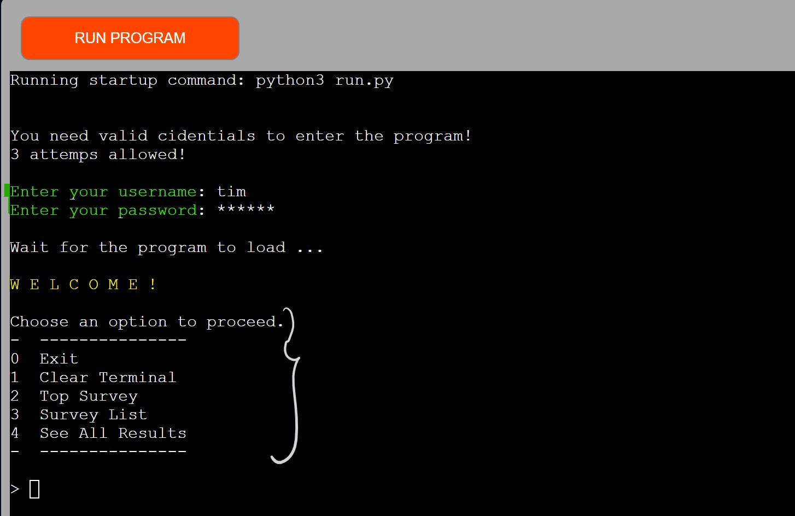

### PPIII: Python Essentials
# Simple Survey

#### This is a Python module that allows users to access and participate in a set of surveys defined in Google Sheets and see the results, as well as possibilty to see te curret status of all surveys!
See the live page [here](https://nb1355pp3.herokuapp.com/)

|**CONTENT**                  |                              |               |
| :---------------------------| :----------------------------| :-------------|
|*PRODUCT*                    |*DEVELOPMENT*                 |*CREDITS*      |
|[Features](#features)        |[Technologies](#technologies) |[Code Used](#code-used)|
|[Requirements](#requirements) |[Languages](#languages)       | [Acknowledgments](#acknowledgments)|
|[Design](#design)            |[Deployment](#deployment)
|[UX](#ux)                    |[Testing](#testing)|

## PRODUCT

### Features

* Defined users can participate in up to five surveys.
* Users have access to up to five surveys at a time.
* The top/current survey should be accessed separetely.
* View the vote results of five survays. 

### Requirements

* Run in a terminal or command prompt.
*  Prompt to enter username and password to authenticate access to the application (3 attempts allowed)
* In case of successful authentication, dispaly the options.
* Options to navigate through the application:
    - Option 1: Clear the screen and return to the main menu.
    - Option 2: Vote on the current survey (if available/only onece permitted).
    - Option 3: Choose a survey from the available options and vote.
    - Option 4: View the details and results of all surveys.
    - Option 0: Exit the application.
* Manage data in Google Sheets

#### Out of Scope
  - Full user authentication, i.e. the correct user pass combination is required to access.
  - Multiple questions in each survay.
#### Future Improvement
  - Option to manage add new user account
  - Upgrade to multiple questions in each survey.
  - Replace google sheets with a proper database structure

### UX
* The requirement is to run the code in a terminal, design elements are limited.
* Improvement in UX is limited to providing users with messages based on actions and options available as follow:

  - Data Management: The code uses the pandas library to handle data as data frames. It reads survey data from the Google Sheets document and stores the user's vote.

  - Input Validation: The code uses pyinputplus to validate user input, ensuring that users select valid options and follow the required input format.

  - Tabulate Output: The code uses the tabulate library to display survey data and results in a tabular format, making it easy for users to read.

  - Error Handling: The code handles KeyboardInterrupt and displays appropriate messages when something goes wrong or when users attempt to input invalid credentials.

### Design 
#### Data Structure
A simple data structure in Google Sheets, including one for users and five for each survey. 

"PP3-data-sets" will be used to store survey data. The sheet is shared with the service account specified in the `creds.json` file.

#### Menue Settings
To add a more flexibility to make changes in naming and order of functions appearing in the menu the name and order of the functions can be changed in `seting.json` file.

##   DEVELOPMENT

### Technologies

### Languages
Python3 is the main language used as required, others are shown in the GitHub language summary belong to the template used for Heroku deployment. 

### Frameworks, Libraries & Programs
- [GitHub](https://github.com/) for hosting repositories.
- [GitPod](https://www.gitpod.io/) as coding environment.
- [Heroku](https://www.heroku.com/) for depolyment.
- [GoogleSheets](https://docs.google.com/spreadsheets/d/1qk_3zw3pQ4fQajFxBfsYQQoSYu33s69l2VDi7di3k6U/edit?usp=sharing) as trmporaray data structure.
- [p3-deployment-template](https://github.com/Code-Institute-Org/p3-template) for deploying a Python command line by CodeInstitute.
- `gspread` : A Python library for accessing Google Sheets.
- `google-auth` : A Python library for handling OAuth 2.0 authentication.
- `pandas` : A data manipulation and analysis library.
- `pyinputplus` : A library for validating user input.
- `tabulate` : A library for creating formatted tables.

### Deployment
Heroku is used for deployment; specific setup instructions can be found in the source template provided by CodeInstitute.
Points to consider:
- using the command "pip3 freeze > requirements.txt" to populate
- Once loged into the Heroku dashboard, a new app was created by clicking on the button 'New' and select 'Create New App'.
- 'Reveal Config Vars' in settings to set environment variables in the file requirements
- 'KEY' the word 'CREDS' was entered, all capitals
- copy creds.json into the 'VALUE' field.
- Add KEY 'PORT' and the VALUE set to '8000'.
- Add a python Buildpack and node.js , python needs to be listed above 
- in deploy setting this repository should be linked, deployment can be manual or automated

## Testing

### Validation Tests

Python: PEP8 CI Python Linter

Python: snyk Code Checker

HTML

CSS

Lighthouse

### User Tests

Ask users to provide valid credentials. Exit after 3 failed attempts

User's credentials are verified against the data in the "users" worksheet of the Google Sheets document 

Control for blanks, mask passwoerd Inputs

Showing 5 required options after the correct user/pass input

Control for input options, integer 0-5

Survey Listing
 Retrieves a list of available surveys from the Google  Sheets document. It displays the survey ID, question, status, and whether the user has already voted for each survey.

Vote Once, Show the survey results

After voting, the code displays the survey results, including the question and the current distribution of votes.

Survey List & Status

Back to Menue

The main menu is available after any option runs except after 0/Exit. Option 1/Clear is available to clear the screen and go back to the menu.
 

###
Detailed developer testing was done during the development, dodumented in the commit history.

#Acknowledgements

Special thanks to [Code Institute](https://learn.codeinstitute.net/dashboard) for providing the knowledg base and learning material.
